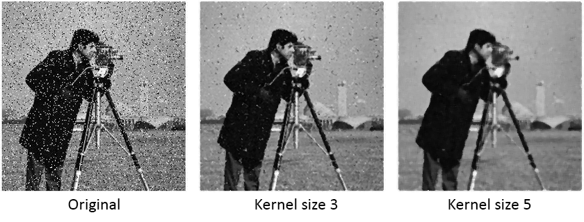
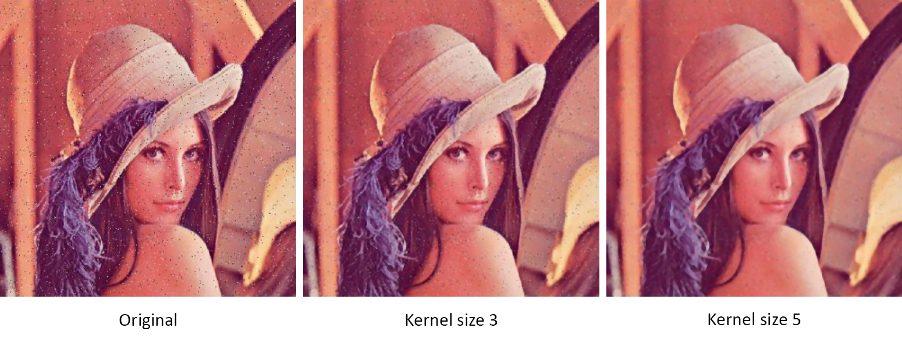

# FastMedianFilter

Fast median filter based on color histogram.
<br/>

# The idea
The classic algorithm of the median filter based on sorting can dramatically slow down processing speed.

So we will use statistics to improve the situation.<br/>
Let's suppose we have an image of size *M×N* pixels and some kernel (a neighborhood of considered pixels, aka. Window) of size *K×K*, where *M* and *N* are some natural numbers and *K* is some natural odd number.

Then do the next steps:
1. Take half of the neighborhood size ((K×K) / 2).
1. Select a neighborhood for each pixel.
1. Build a histogram for the selected neighborhood.
1. Sum the frequencies for each intensity in the histogram until we reach half of the neighborhood size (calculated in Step 1).
1. The result will be an intensity at which we reach half of the neighborhood size.
1. Repeat for each pixel of the image.

Note:
> There is no reason to fully recalculate neighbourhood histogram for each pixel within one row.
> Just remove the first column of current neighbourhood and add the new one to the end.
> However, when we are moving from one image row to another, there is no way to avoid entire recalculation.

<br/>

# Example
Let's consider the next neighborhood:
```
12  3   6
4   4   8
3   4   1
```
Then build a histogram from it:


If we have done all the steps mentioned above, we will have a median intensity of 4.

We can check it by sorting neighborhood values in ascending order and taking the middle one.
```
1 3 3 4 [4] 4 6 8 12
```
Obviously, we will have the same result.
 <br/>
 
 # Screenshots
 
 
